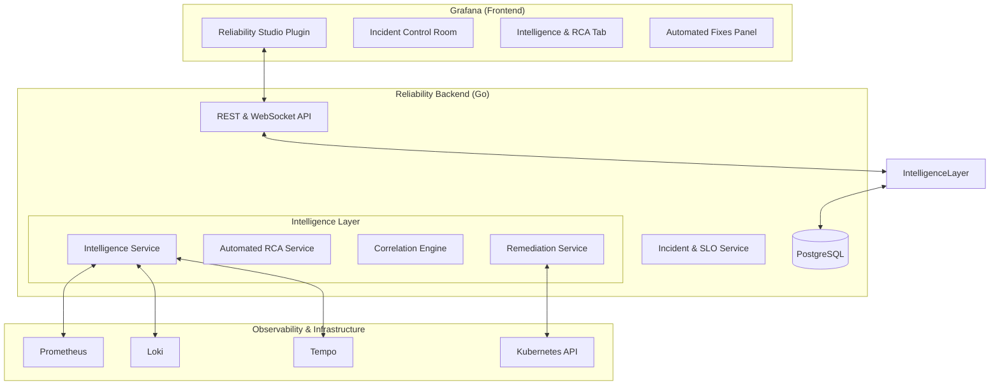

# Reliability Studio: Intelligent Incident Response Architecture

## Overview
Reliability Studio is a Grafana-integrated Reliability Control Plane. This document outlines the architecture for the "Intelligent Incident Response" system, which automates root cause analysis (RCA), alert correlation, and remediation.

## System Architecture

## Core Components

### 1. Intelligence Service (`IntelligenceService`)
The brain of the system. It orchestrates automated analysis when an incident is detected or updated.
- **Log Pattern Analysis**: Clusters Loki logs to find anomalies during incident windows.
- **Metric Correlation**: Finds metrics with similar "spiky" patterns relative to the incident trigger.
- **Impact Assessment**: Calculates the blast radius (affected users, services, SLOs).

### 2. Automated RCA Service (`RCAService`)
Uses a combination of heuristics and LLM (optional) to generate a structured root cause analysis.
- **Evidence Gathering**: Collects timeline events, metrics, and logs.
- **Hypothesis Ranking**: Ranks investigation hypotheses based on evidence confidence.

### 3. Remediation Service (`RemediationService`)
Provides "Self-healing" capabilities.
- **Runbooks-as-Code**: Definitive actions for specific incident types.
- **One-Click Fixes**: Allows SREs to execute predefined actions (e.g., rollover pods, toggle feature flag).
- **Automated Rollover**: Automatically scales or restarts services if high confidence of recovery.

### 4. Correlation Engine (Enhanced)
Groups related alerts from diverse sources into a single logical "Incident" to prevent alert fatigue.

## Data Model

### `intelligence_insights`
- `incident_id`: Reference to incident.
- `summary`: AI-generated summary.
- `confidence_score`: Confidence of the analysis.
- `evidence`: JSON blob of metrics/logs pointers.

### `remediation_actions`
- `name`: Human readable name (e.g., "Scale up auth-service").
- `action_type`: `kubernetes`, `script`, `webhook`.
- `payload`: Data needed for execution.
- `status`: `pending`, `executing`, `success`, `failed`.

## Reliability & Security
- **Circuit Breakers**: Protect internal services and external data sources.
- **Rate Limiting**: Applied to all AI/ML analysis and remediation calls.
- **Audit Logs**: Every remediation action is logged with the user's ID.
- **RBAC**: Only authorized SREs can execute high-impact remediation.
